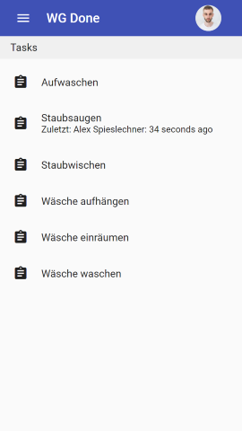
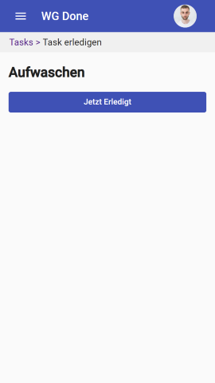
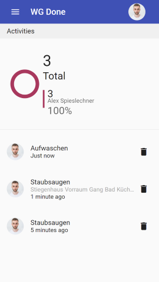
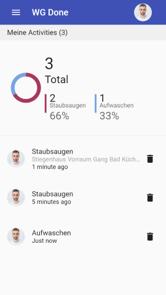

# WgDone

A chore tracking app to review which roommate does the most chores (me obviously). Annoy your roommates with caution.

## Screenshots

## Stack

Its running a frontend only PWA, and just requires a firebase storage. All CRUD operations are done directly against the firebase api, via the angularFire sdk.

## License

MIT. Do what you want with it.
